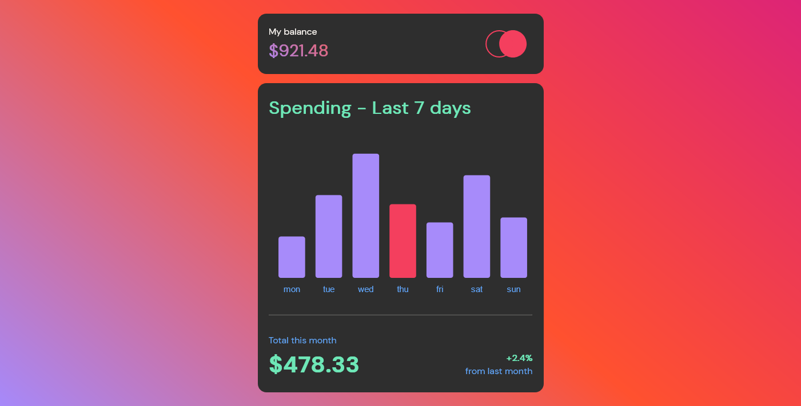
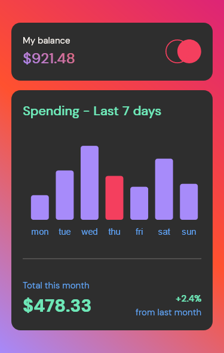

# Frontend Mentor - Expenses chart component solution

This is a solution to the [Expenses chart component challenge on Frontend Mentor](https://www.frontendmentor.io/challenges/expenses-chart-component-e7yJBUdjwt). Frontend Mentor challenges help you improve your coding skills by building realistic projects.

## Table of contents

- [Overview](#overview)
  - [The challenge](#the-challenge)
  - [Screenshot](#screenshot)
  - [Links](#links)
- [My process](#my-process)
  - [Built with](#built-with)
  - [What I learned](#what-i-learned)
  - [Continued development](#continued-development)
  - [Useful resources](#useful-resources)
- [Author](#author)

## Overview

### The challenge

Users should be able to:

- View the bar chart and hover over the individual bars to see the correct amounts for each day
- See the current day’s bar highlighted in a different colour to the other bars
- View the optimal layout for the content depending on their device’s screen size
- See hover states for all interactive elements on the page
- **Bonus**: Use the JSON data file provided to dynamically size the bars on the chart

### Screenshot

### Links

- Solution URL: [Code](https://github.com/tan911/expenses-chart-component)
- Live Site URL: [Livesite](https://tan911.github.io/expenses-chart-component/)

## My process

### Built with

- Semantic HTML5 markup
- CSS custom properties
- BEM (naming)
- Flexbox
- Mobile-first workflow
- Sass/scss
- [Chartjs](https://www.chartjs.org/) - JS library

### What I learned

As a novice, this is my first time working locally with a JSON file and integrating it with chartjs. It's been a great learning experience, but I'm not sure if I implemented it correctly, so I'm leaving it the way it is.

One of the most important lessons from this process is that occasionally using a CDN is preferable than downloading it locally. This is because I have a difficulty while working with charts (using npm), and whenever I try to use it (after obviously reading the documentation - a guide), it always throws me an error for no apparent reason.
However, the documentation advises utilizing any bundlers if you downloaded it locally, therefore I choose to use CDN to address my problem rather than using bundlers 😂👏.

### Continued development

The tooltip and bar chart are functioning fine, but I need to take a closer look to determine what design is behind the lack of a space between the tooltip and bar chart and that's the thing I want to address in the future.

### Useful resources

- [Stackoverflow](https://stackoverflow.com/)
- [Mozilla web docs](https://developer.mozilla.org/en-US/)
- [Chartjs web docs](https://www.chartjs.org/)

## Author

- Website - [Jovan Lanutan](https://portfolio-tan911.vercel.app/)
- Frontend Mentor - [@tan](https://www.frontendmentor.io/profile/tan911)
